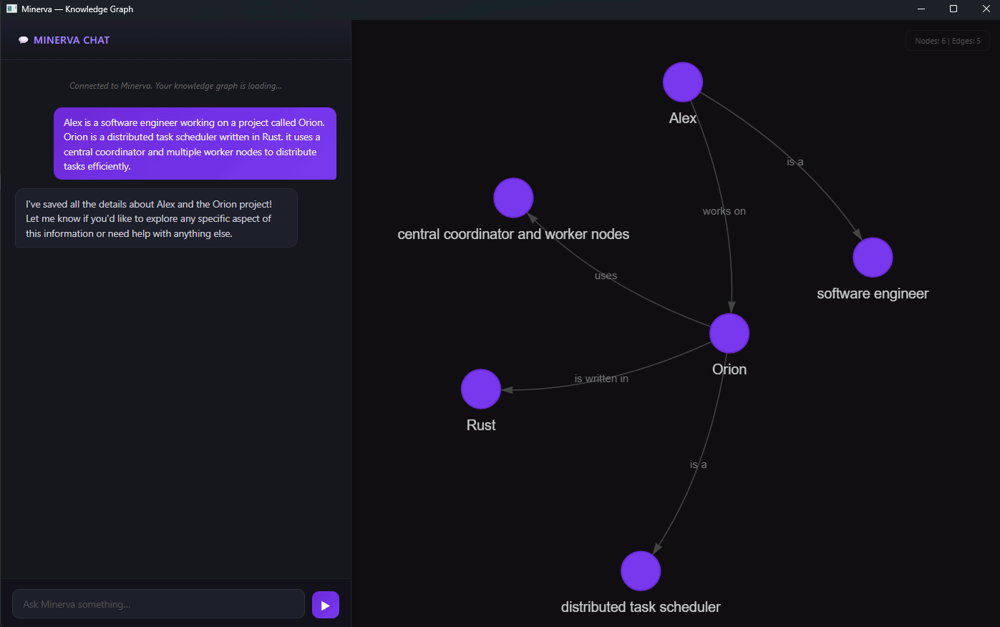

# Minerva

Minerva is an experimental, privacy-first personal AI assistant built in Python. It leverages local Large Language Models (LLMs) via `llama.cpp` to converse, learn, and dynamically build a long-term memory about the user—all while keeping your data 100% private and stored locally on your device.

---

## Demo
The interactive Knowledge Graph auto-updates in real-time as Minerva learns facts during conversation:


---

## Key Features & Architecture

Minerva operates on an **Active Tool-Based Memory Architecture** rather than passively summarizing chat logs. During conversation, the LLM utilizes thinking capabilities (`<think>`) and mid-stream XML tool calls to retrieve knowledge or mutate its memory graph.

- **Mid-Stream Tool Interception (`RAGChat`)**: 
  Unlike traditional static RAG pipelines that fetch context *before* prompt generation, Minerva natively intercepts `<tool>...</tool>` XML tags during token generation. Generation pauses, the tool (`retrieve` or `manage_memory`) executes, the exact output is injected back into the context, and generation seamlessly resumes.
- **Hybrid Entity Knowledge Graph + Vector DB**:
  - **Graph Topology**: Facts are stored as interconnected entities (`EntityNode`) and directional relations (`GraphEdge`) in a local SQLite database.
  - **Vector Embeddings**: Both entity nodes and relational edges are indexed using SentenceTransformers (`paraphrase-multilingual-MiniLM-L12-v2`).
  - **Graph-Expanded Retrieval**: Semantic search results trigger topological graph expansion (`expand_nodes`) up to N hops, followed by neural reranking with a CrossEncoder (`ms-marco-MiniLM-L-6-v2`).
- **Dynamic Memory Operations (`manage_memory`)**:
  When Minerva learns new details or updates old information, she issues structured JSON commands to create, update, or delete entity nodes and relational triplets in real-time.
- **Interactive vis.js Knowledge Graph**:
  The PySide6 desktop GUI features a dual-panel layout: a streaming chat interface on the left and an auto-refreshing `vis.js` graph visualization on the right.
- **Multi-Model Routing & Hardware Management**:
  - **Model Profiles**: Switch between different GGUF models (e.g. `Qwen3.5 9B` for quality vs `Qwen3.5 4B` for speed) directly from the GUI Settings modal.
  - **VRAM Estimation**: Proactively probes system GPU memory (via PyTorch CUDA or Win32 DXGI) to automatically optimize GPU offload layers (`n_gpu_layers`) and context window (`n_ctx`), preventing Out-Of-Memory (OOM) crashes.
  - **Auto-Downloader**: Automatically downloads and resumes GGUF models from HuggingFace Hub with streaming chunk support.

---

## Project Structure & Core Modules

```
src/
├── chat.py                 # High-level API entry point for RAGChat
├── config.py               # Configuration manager, model registry & TOML persistence
├── paths.py                # Resource path resolver and AppData directory manager
├── run.py                  # Desktop application runner (Splash screen + Main Window)
├── memory/
│   ├── db.py               # SQLAlchemy ORM schemas (EntityNode, GraphEdge, EmbeddingIndex, User)
│   ├── store.py            # Graph DB mutations (triplet ingestion, entity/edge upserts & deletes)
│   └── retrieve.py         # Hybrid search engine (Vector similarity + N-hop graph expansion + Reranking)
├── models/
│   ├── base_llm.py         # Thread-safe llama-cpp-python wrapper (CustomLLM)
│   ├── downloader.py       # Resumable HuggingFace Hub GGUF model downloader
│   ├── embeddings.py       # Lazy-loaded SentenceTransformer & CrossEncoder models
│   ├── rag_chat.py         # Core conversational RAG interceptor & tool parsing engine
│   └── tools.py            # Tool execution handlers for `retrieve` and `manage_memory`
├── gui/
│   ├── main.py             # PySide6 MainWindow (QWebEngineView + QWebChannel integration)
│   ├── bridge.py           # Python <-> JS WebChannel bridge (streaming slots, settings, model init)
│   ├── splash.py           # Auto-centering and auto-scaling splash screen window
│   └── stream_parser.py    # State machine for parsing <think> tags & <action:TOOL> UI events
└── utils/
    ├── vram.py             # GPU VRAM detection & safe layer/context memory profiler
    ├── win32.py            # Windows DXGI/WMI hardware memory probing fallback
    └── general.py          # Helper utilities (cosine similarity, short ID hashing)
```

---

## Installation

### Prerequisites
- Python 3.10+
- Windows or Linux
- A GPU with CUDA or Vulkan support is recommended for best performance.

### 1. Install Dependencies
```bash
pip install -r requirements.txt
```

### 2. Enable GPU Acceleration for PyTorch
```bash
pip3 install --upgrade --ignore-installed torch torchvision --index-url https://download.pytorch.org/whl/cu126
```

### 3. Build `llama-cpp-python` with Hardware Offloading

To build `llama-cpp-python` from source on Windows, you need to have **Visual Studio 2022 with C++ build tools** installed.

#### With CUDA:
Make sure you have the CUDA toolkit installed and configured for your system. Multiple versions may lead to silent failures. Use `nvcc --version` to check your current version.

- **Windows (PowerShell):**
  ```powershell
  $env:CMAKE_ARGS="-DGGML_CUDA=on"; pip install --ignore-installed --no-cache-dir llama-cpp-python
  ```
- **Linux:**
  ```bash
  CMAKE_ARGS="-DGGML_CUDA=on" pip install --ignore-installed --no-cache-dir llama-cpp-python
  ```

#### With Vulkan:
Make sure you have the Vulkan SDK installed and configured for your system. Multiple versions may lead to silent failures. Use `vulkaninfo` to check your current version. On Windows, you will also need the Windows SDK.

- **Windows (PowerShell):**
  ```powershell
  $env:CMAKE_ARGS="-DGGML_VULKAN=on"; pip install --ignore-installed --no-cache-dir llama-cpp-python
  ```
- **Linux:**
  ```bash
  CMAKE_ARGS="-DGGML_VULKAN=on" pip install --ignore-installed --no-cache-dir llama-cpp-python
  ```

> 💡 *Note: Installation of `llama-cpp-python` with CUDA/Vulkan bindings compiles native C++/CUDA code and can take up to 30 minutes depending on your system configuration. Please be patient while it compiles!*

---

## Usage

### Running the Desktop App
Launch Minerva by running:
```bash
python -m src.run
```

### Configuration & Settings
You can select models and adjust hardware settings directly in the GUI **Settings Modal**, or edit `config.toml` manually:
```toml
[llm]
model_key = "qwen3.5-9b"
n_ctx = 8192
n_gpu_layers = 0
n_batch = 512
use_mmap = true
use_mlock = true
verbose = false
```

### Programmatic Usage
You can integrate Minerva into your own applications using the `Chat` wrapper:
```python
from src.chat import Chat

assistant = Chat()
# Stream responses with active RAG & tool execution
for token in assistant.send_message("What do you know about my sister Sarah?", stream=True):
    print(token, end="", flush=True)
```

---

## Example Testing Prompts

Use these natural conversation prompts to test Minerva's active memory storage (`manage_memory`), graph building, and multi-hop retrieval (`retrieve`).

### Scenario 1: Family, Locations & Pets
**Tell Minerva:**
- *"My sister Sarah moved to Berlin last month and started working as a UX Designer at TechCorp."*
- *"Sarah adopted a 2-year-old Golden Retriever named Buster who loves running in Tiergarten."*
- *"Her senior manager at TechCorp is Alex, who is a coffee enthusiast and owns a La Marzocco machine."*

**Test Questions:**
- *"Where does my sister live and what is her job?"*
- *"What pet does Sarah have and where do they go for runs?"*
- *"Who is Alex and what kind of coffee machine does he have?"*
- *"Who manages my sister at work?"*

### Scenario 2: Work Projects & Tech Stack
**Tell Minerva:**
- *"I'm building a project called Hyperion with my lead developer Marcus."*
- *"Hyperion uses PostgreSQL for the primary database and FastAPI for the backend framework."*
- *"Marcus prefers Tailwind CSS for styling, but our client Elena insisted we use pure custom CSS."*

**Test Questions:**
- *"Who am I working with on project Hyperion?"*
- *"What tech stack are we using for Hyperion?"*
- *"What styling approach did Elena request for our project?"*

### Scenario 3: Preferences & Multi-hop Relations
**Tell Minerva:**
- *"My favorite restaurant in Munich is Osteria Del Corso, which is famous for its Truffle Pasta."*
- *"I always order an Aperol Spritz when I visit Osteria Del Corso with my friend David."*
- *"David is severely allergic to shellfish, so we always avoid seafood restaurants."*

**Test Questions:**
- *"What is my favorite restaurant in Munich and what drink do I get there?"*
- *"Why do David and I avoid seafood places?"*
- *"Who goes to Osteria Del Corso with me?"*

---

## Testing

The Minerva test suite isolates test operations using transient `sqlite:///:memory:` database instances.

To run the complete unit test suite:
```bash
python -m pytest tests/
```

---

## License

This project is licensed under the **MIT License**.

It uses **PySide6 (Qt for Python)**, which is licensed under LGPLv3.